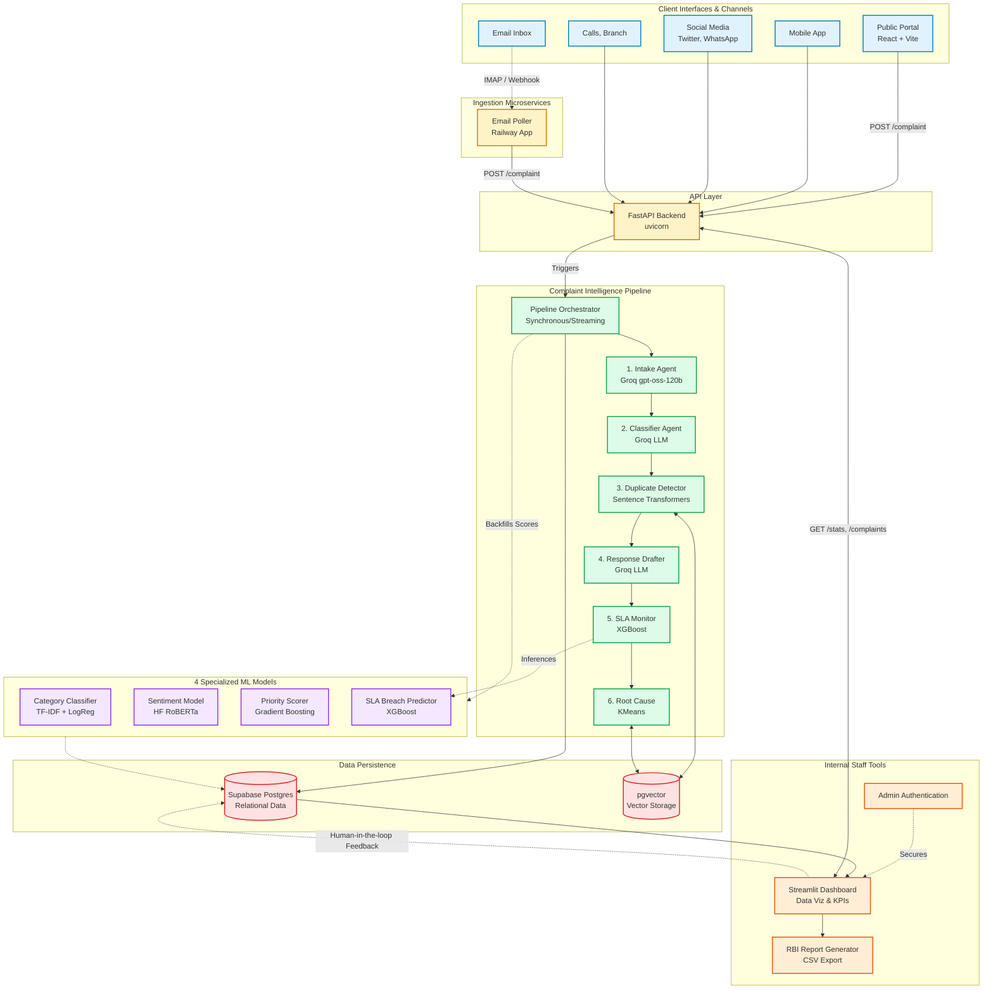

# ComplaintIQ System Architecture

This document outlines the complete end-to-end system architecture for the **ComplaintIQ** project. The platform comprises a customer-facing public portal, an intelligent multi-agent pipeline backed by machine learning models, a scalable FastAPI backend, and an interactive Streamlit dashboard for internal bank staff.

## System Architecture Diagram

---

## Detailed Block Descriptions

### 1. Client Interfaces & Channels (Client Tier)
This tier captures raw complaints from multiple omni-channel sources and forwards them to the central backend.
* **Public Portal**: A customer-facing single-page application built using React and Vite. It is hosted on Netlify. It allows customers to securely and anonymously lodge complaints.
* **Email Poller Microservice**: A dedicated microservice hosted publicly on **Railway** that continuously monitors the bank's email inbox and forwards incoming email complaints to the central API.
* **Mobile App, Social Media, Calls, Branch**: Represents the other various channels from which the bank ingests complaints. All raw text is aggregated and normalized before hitting the API.

### 2. API Layer (FastAPI Backend)
* **FastAPI Service**: Serves as the central gateway for the system (`api/main.py`). It exposes endpoints like `POST /complaint` (to ingest a new complaint), `GET /complaints` (for filtering and listing), `GET /stats` (for dashboard KPIs), and `GET /report` (for compliance data). It handles concurrent requests asynchronously using `uvicorn`.

### 3. Complaint Intelligence Pipeline (Core Engine)
The orchestrator drives each complaint through a sequence of 6 AI-powered agents.
* **Pipeline Orchestrator**: Manages the flow of data between the API, the 6 AI agents, the ML backfill processes, and the database. It handles logic like **Auto-Resolution** for low severity, standard complaints, or duplicates to save agent execution cycles.
* **Agent 1: Intake**: Powered by Groq's `gpt-oss-120b`, it extracts structured fields (customer details, language, channel) from unstructured, multilingual raw text (English/Hindi/Marathi).
* **Agent 2: Classifier**: An LLM-based agent that determines the primary category, severity level, and initial sentiment of the complaint.
* **Agent 3: Duplicate Detector**: Utilizes `sentence-transformers all-MiniLM-L6-v2` to create embeddings and queries ChromaDB (using cosine similarity) to flag duplicate complaints from the same customer.
* **Agent 4: Response Drafter**: Leverages the Groq LLM to automatically generate a policy-compliant response tailored to the customer's preferred language.
* **Agent 5: SLA Monitor**: Calculates the regulatory due date based on predefined RBI rules and utilizes an XGBoost model to assign an SLA breach probability.
* **Agent 6: Root Cause**: Employs KMeans clustering over complaint embeddings to detect systemic issues and highlight city hotspots.

### 4. Specialized ML Models
These traditional and deep learning models act as a "second opinion" to validate LLM outputs and compute composite risk scores.
* **Category Classifier**: Uses TF-IDF and Logistic Regression to categorize complaints, boasting a 97% accuracy rate to cross-verify Agent 2's output.
* **Sentiment Model**: A local inference model using HuggingFace's `twitter-roberta-base-sentiment-latest` to accurately score customer emotion.
* **Priority Scorer**: A Gradient Boosting model that dictates the operational priority of the ticket (R² 0.997).
* **SLA Breach Predictor**: A heavily tuned XGBoost model (with CV AUC 0.9233) used by Agent 5 to predict the statistical likelihood of an SLA violation.

### 5. Data Persistence (Data Tier)
* **Supabase Postgres**: The primary cloud relational database storing structured complaint records, SLA tracking metadata, model confidence scores, and human-in-the-loop feedback.
* **pgvector**: A PostgreSQL extension acting as the vector database to hold semantic embeddings generated by the sentence-transformers. It is queried for duplicate detection and systemic root cause clustering.

### 6. Internal Staff Tools (Dashboard Tier)
* **Streamlit Dashboard**: The operational hub for bank staff. Deployed on Streamlit Cloud and protected by **Admin Authentication**, it features 9 interactive tabs including a live feed, customer risk breakdown, interactive India map (Plotly geo), SLA trackers, and a model performance leaderboard. It reads directly from the Supabase Postgres database and the FastAPI endpoints.
* **RBI Report Generator**: A compliance module connected to the dashboard and API that exports the required regulatory SLA metrics into a formatted CSV.
* **Human-in-the-loop Feedback**: Bank staff can manually override incorrect LLM/ML predictions in the dashboard. These corrections propagate directly back to the Postgres DB to improve future runs.
