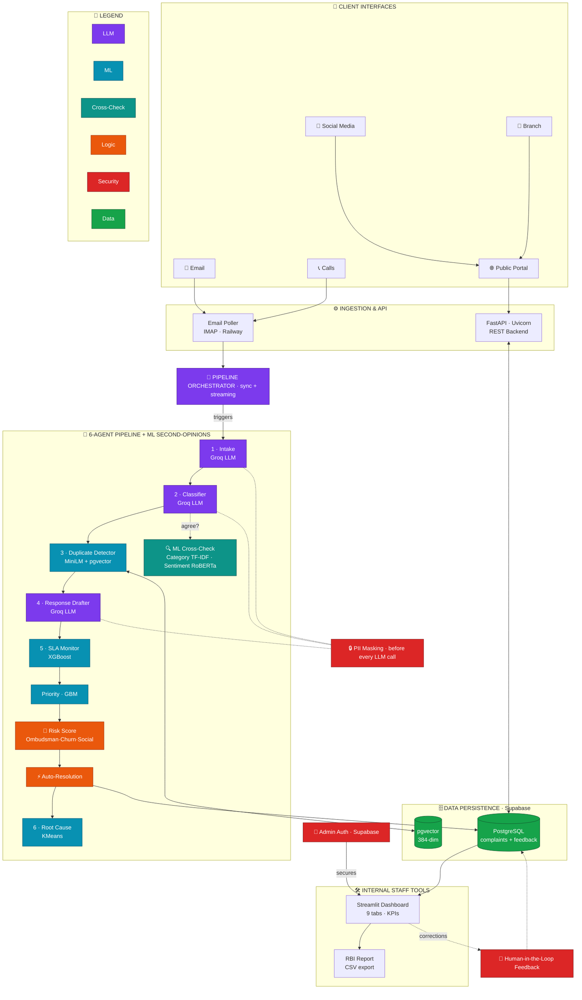
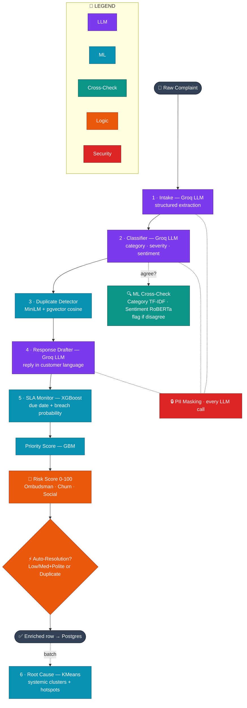

# ComplaintIQ — System Architecture Diagrams

Two Mermaid diagrams for the final-round presentation:

- **Part A — Full System:** the whole platform end-to-end (the "this is a real product" slide).
- **Part B — Pipeline Zoom:** inside the AI brain (the "this is how it thinks" slide).

> **Export tip:** paste a diagram into <https://mermaid.live> and export PNG/SVG.
> Start copying from the `flowchart` line — do **not** include the ```` ```mermaid ```` fence.

## Colour legend

| Colour | Meaning |
|--------|---------|
| 🟣 Purple | **LLM** — Groq `llama-3.3-70b` (language tasks: intake, classify, draft) |
| 🔵 Cyan | **Trained ML** — prediction tasks (duplicate, SLA, root-cause, priority) |
| 🟢 Teal | **ML cross-check** — independently audits the LLM's category & sentiment |
| 🟠 Orange | **Business logic** — risk score + auto-resolution |
| 🔴 Red | **Security** — PII masking + admin auth |
| 🟢 Green | **Data** — Supabase PostgreSQL + pgvector |

---

## Part A — Full System Architecture



---

## Part B — Inside the Pipeline (AI brain zoom)



---

## Talking points

- **Part A:** *"This isn't a notebook demo — it's a deployed platform: a public portal, a live email channel, cloud Postgres with vector search, an auth-gated dashboard, and a human-in-the-loop feedback loop."*
- **Part B:** *"We use the right engine for each job — LLM for language, classical ML for prediction — and on the two subjective calls (category & sentiment) a second ML model audits the LLM. Disagreement triggers human review, which feeds retraining."*
